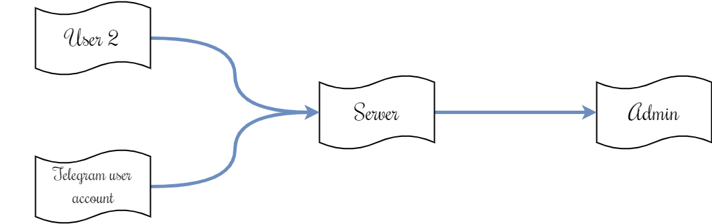
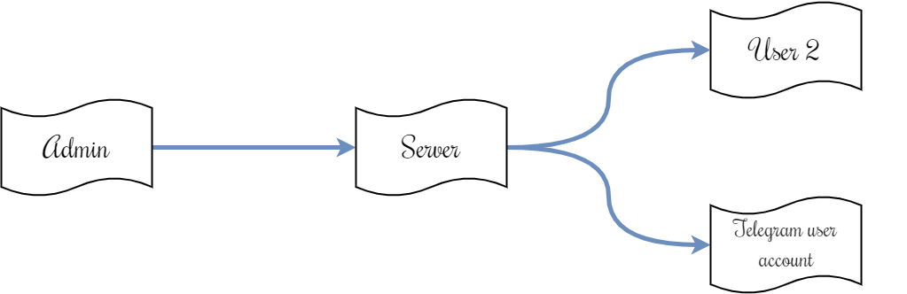

<header>

<div align="center">

<h1 align="center">Socketgram - Support Chat</h1>

<p>Simple project that combines database, Express, Socket.io and Telegram Bot API written in Node.js</p>

<a href="https://core.telegram.org/bots/api">
	
</a>
<a href="https://github.com/VDS13/Socketgram-Support-Chat">
	
</a>
</div>

</header>

## Introduction

The project is a technical support chat, with the ability to send messages both from the site page and from Telegram through a chat bot.

## Libraries used

### Node.js
* [socket.io](https://github.com/socketio/socket.io) - library that provides two-way communication based on real-time events based on WebSockets
* [node-telegram-bot-api](https://github.com/yagop/node-telegram-bot-api) - library for working with Telegram Bot API
* [crypto-js](https://github.com/brix/crypto-js) - crypto standards library
* [mysql2](https://github.com/sidorares/node-mysql2) - MySQL database library
* [express](https://github.com/expressjs/express) - web framework
* [chat-app](https://www.bootdey.com/snippets/view/chat-app) - chat layout on Bootstrap

### PHP
* LDAP
* MySQL

## Project composition

0. [Principle of operation](#start)
1. [Chat server](https://github.com/VDS13/Socketgram-Support-Chat/blob/main/server/README.md#server)
	- [Structure](https://github.com/VDS13/Socketgram-Support-Chat/blob/main/server/README.md#struct)
	- [Installation](https://github.com/VDS13/Socketgram-Support-Chat/blob/main/server/README.md#install)
	- [Configuration file](https://github.com/VDS13/Socketgram-Support-Chat/blob/main/server/README.md#conf)
	- [Server events](https://github.com/VDS13/Socketgram-Support-Chat/blob/main/server/README.md#event)
2. [Admin panel in PHP](https://github.com/VDS13/Socketgram-Support-Chat/blob/main/admin_client_php/README.md#adminphp)
	- [Initial setup](https://github.com/VDS13/Socketgram-Support-Chat/blob/main/admin_client_php/README.md#startadminclient)
	- [Admin panel events](https://github.com/VDS13/Socketgram-Support-Chat/blob/main/admin_client_php/README.md#eventadmin)
	- [Entering the tool](https://github.com/VDS13/Socketgram-Support-Chat/blob/main/admin_client_php/README.md#loginadmin)
3. [Client block](https://github.com/VDS13/Socketgram-Support-Chat/blob/main/user_client/README.md#clientphp)
	- [Initial setup](https://github.com/VDS13/Socketgram-Support-Chat/blob/main/user_client/README.md#startuserclient)
	- [Client block events](https://github.com/VDS13/Socketgram-Support-Chat/blob/main/user_client/README.md#eventuser)
	- [Telegram-bot](https://github.com/VDS13/Socketgram-Support-Chat/blob/main/user_client/README.md#usertlgrm)

## <a name="start"></a> Principle of operation

There are two roles: admin and user. The admin has access to all rooms, the user - only to the one in which he is.
Rooms are formed by hashing a string like: `id + <ClientID> + Secret key`. For example: `md5("id123qwerty")`.
The connection of the admin to the server is determined by sending a request (query) when connecting (an example of the parameters is below in the configuration file):
```js
io(DOMEN_SERVER, { transports : ['websocket', 'polling', 'flashsocket'], query : {[SERVER_KEY]: SERVER_PSWD} })
```

Let's consider two examples: when the user is authorized in the telegram bot and when the user is not authorized.

### User 1: not logged in
The user sends a message from the site, the message arrives at the server via WebSockets, is written to the database and sent to the admin:


The response from the admin to the user follows the same principle:


### User 2: logged in
The user sends a message from the site or Telegram, the message arrives at the server via WebSockets, is written to the database and sent to the admin:


The response from the admin to the user is sent through the admini panel via WebSockets, comes to the server, is recorded in the database and sent to the user's personal account and to Telegram via the Telegram bot:



## License

**The MIT License (MIT)**

Copyright © 2022 Dmitry Vyazin