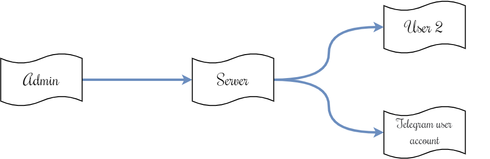

<header>

<div align="center">

<h1 align="center">Socketgram - Support Chat</h1>

<p>Проект, объединяющий возможности баз данных, Express, Socket.io и Telegram Bot API, написанный на Node.js</p>

<a href="https://core.telegram.org/bots/api">
	
</a>
<a href="https://github.com/VDS13/Socketgram-Support-Chat">
	
</a>
</div>

</header>

## Введение

Проект - чат технической поддержки, с возможностью отправки сообщений как со страницы сайта, так и из Телеграм через чат-бота.

## Используемые библиотеки

### Node.js
* [socket.io](https://github.com/socketio/socket.io) - библиотека, обеспечивающая двустороннюю связь на основе событий в реальном времени на основе WebSockets
* [node-telegram-bot-api](https://github.com/yagop/node-telegram-bot-api) - библиотека для работы с Telegram Bot API
* [crypto-js](https://github.com/brix/crypto-js) - библиотека крипто-стандартов
* [mysql2](https://github.com/sidorares/node-mysql2) - библиотека для работы с БД MySQL
* [express](https://github.com/expressjs/express) - веб-фреймворк
* [chat-app](https://www.bootdey.com/snippets/view/chat-app) - вёрстка чата на Bootstrap

### PHP
* LDAP
* MySQL

## Состав проекта

0. [Принцип работы](#start)
1. [Сервер чата](https://github.com/VDS13/Socketgram-Support-Chat/blob/main/server/README_ru.md#server)
	- [Структура](https://github.com/VDS13/Socketgram-Support-Chat/blob/main/server/README_ru.md#struct)
	- [Установка](https://github.com/VDS13/Socketgram-Support-Chat/blob/main/server/README_ru.md#install)
	- [Конфигурационный файл](https://github.com/VDS13/Socketgram-Support-Chat/blob/main/server/README_ru.md#conf)
	- [События сервера](https://github.com/VDS13/Socketgram-Support-Chat/blob/main/server/README_ru.md#event)
2. [Административная панель на PHP](https://github.com/VDS13/Socketgram-Support-Chat/blob/main/admin_client_php/README_ru.md#adminphp)
	- [Начальная настройка](https://github.com/VDS13/Socketgram-Support-Chat/blob/main/admin_client_php/README_ru.md#startadminclient)
	- [События административной панели](https://github.com/VDS13/Socketgram-Support-Chat/blob/main/admin_client_php/README_ru.md#eventadmin)
	- [Вход в инструмент](https://github.com/VDS13/Socketgram-Support-Chat/blob/main/admin_client_php/README_ru.md#loginadmin)
3. [Клиентский блок](https://github.com/VDS13/Socketgram-Support-Chat/blob/main/user_client/README_ru.md##clientphp)
	- [Начальная настройка](https://github.com/VDS13/Socketgram-Support-Chat/blob/main/user_client/README_ru.md#startuserclient)
	- [События клиентского блока](https://github.com/VDS13/Socketgram-Support-Chat/blob/main/user_client/README_ru.md#eventuser)
	- [Телеграм-бот](https://github.com/VDS13/Socketgram-Support-Chat/blob/main/user_client/README_ru.md#usertlgrm)

## <a name="start"></a> Принцип работы

Существуют две роли: админ и пользователь. Админ имеет доступ ко всем комнатам, пользователь - только к той, в которой находится.
Комнаты формируются хэшированием строки типа `id + <id пользователя> + секретный ключ`. К примеру `md5("id123qwerty")`.
Подключение администратора к серверу определяется отправкой запроса(query) при коннекте(пример параметров ниже в конфигурационном файле):
```js
io(DOMEN_SERVER, { transports : ['websocket', 'polling', 'flashsocket'], query : {[SERVER_KEY]: SERVER_PSWD} })
```

Рассмотрим два примера: когда пользователь авторизовался в телеграм-боте и когда пользователь не авторизовался.

### User 1: не авторизовался
Пользователь отправляет сообщение с сайта, сообщение через WebSockets приходит на сервер, записывается в базу и отправляется администратору:


Ответ от администратора пользователю проходит по тому же принципу:


### User 2: авторизовался
Пользователь отправляет сообщение с сайта или Телеграм, сообщение через WebSockets приходит на сервер, записывается в базу и отправляется администратору:


Ответ от администратора пользователю отправляется через административную панель через WebSockets приходит на сервер, записывается в базу и отправляется в личный кабинет пользователя и на Телеграм через Телеграм-бота:



## Лицензия

**The MIT License (MIT)**

Copyright © 2022 Dmitry Vyazin