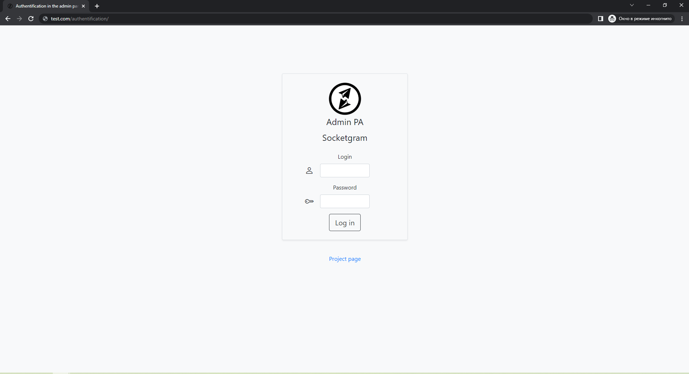
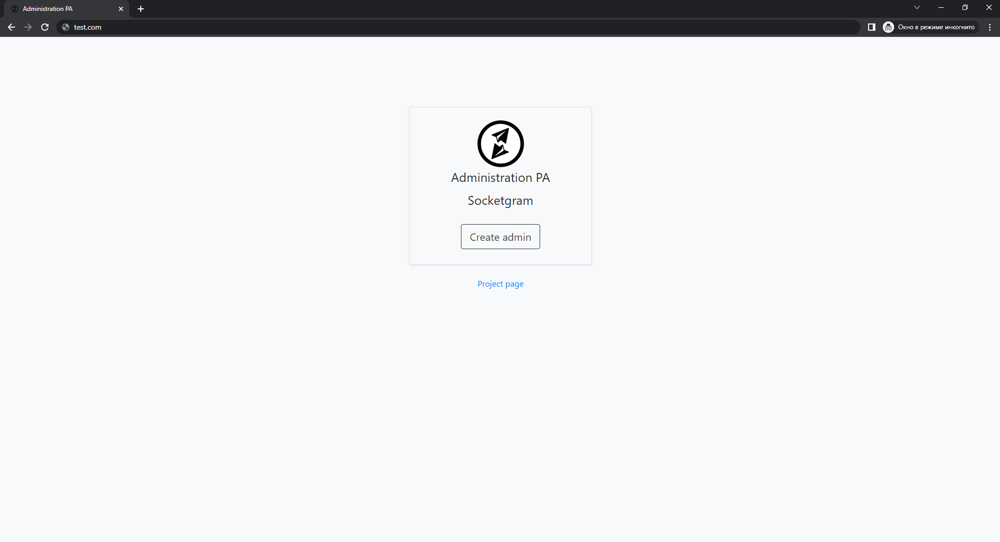
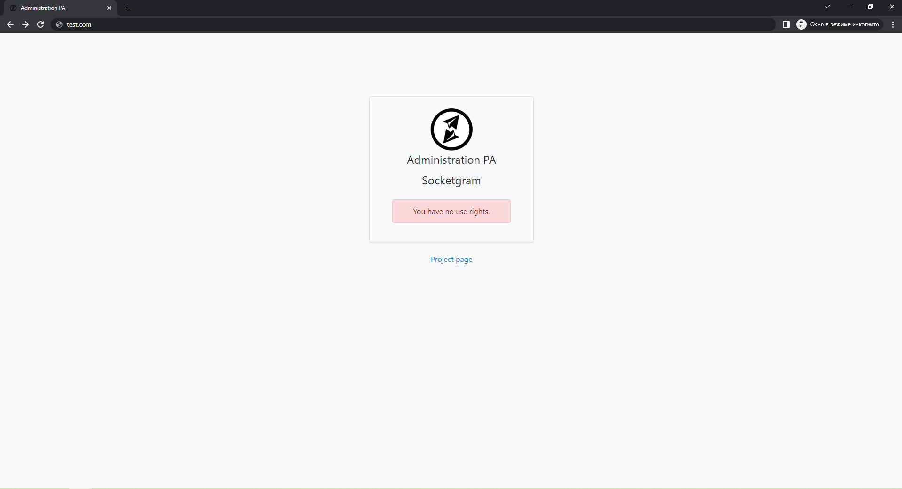
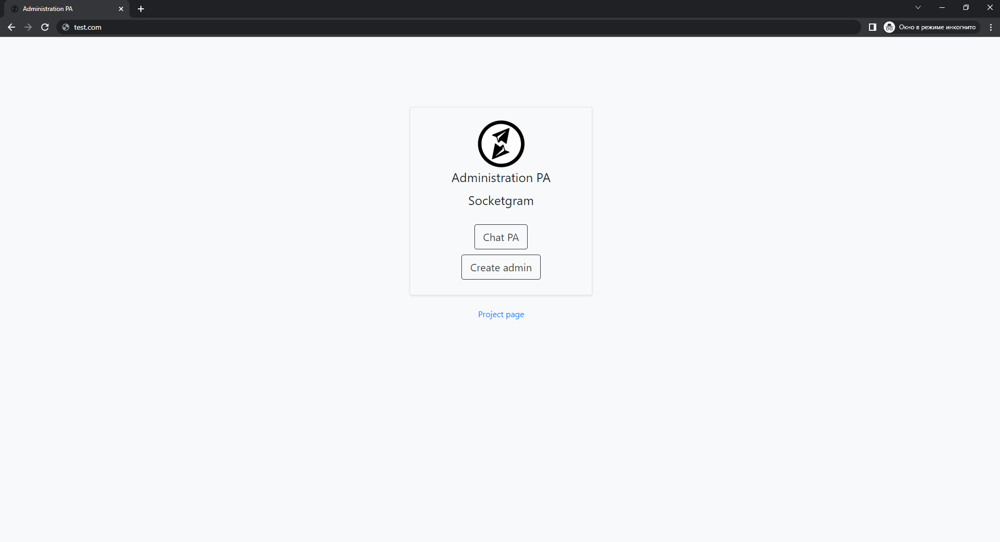
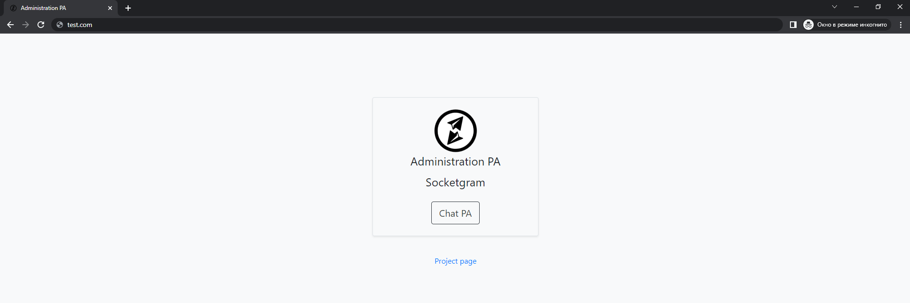
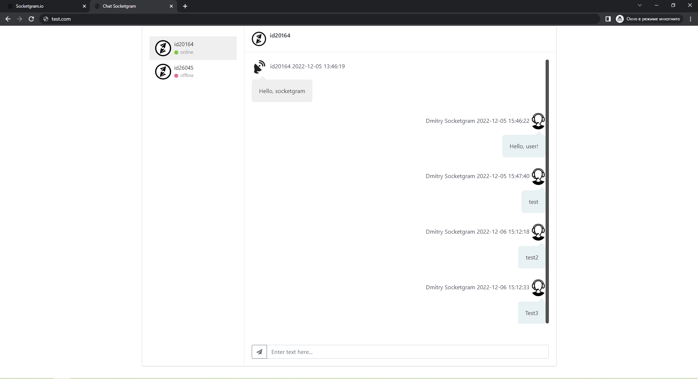
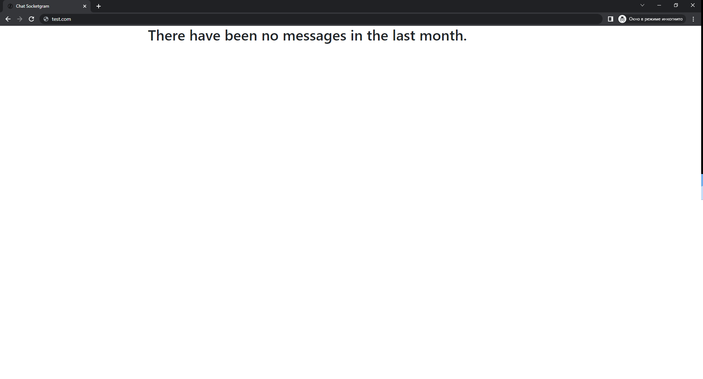

## <a name="adminphp"></a> Admin panel in PHP

* [Initial setup](#startadminclient)
* [Admin panel events](#eventadmin)
* [Entering the tool](#loginadmin)

### <a name="startadminclient"> Initial setup
To start work, you need to fill in the configuration files `config/const.js` and `config/const.php`:
#### `config/const.js`
```js
//URL of the admin panel folder
const DOMEN = 'http://test.com/';

//Company logo
const LOGO_COMPANY = 'socketgram.io.min.png';

//Chat Server URL
const DOMEN_SERVER = 'https://your.domen.com/';

//Admin login name (password) and key (admin socket definition)
const SERVER_KEY = 'admin';
const SERVER_PSWD = 'adminpass';

//Company name
const COMPANY = 'Socketgram';
```

#### `config/const.php`
```php
/*************************Default parameters**********************************/
define("SUPER_USER", 'VDS13');                                       //Superuser/administrator login
define("SECRET_KEY", 'key');                                         //Secret key
define("COMPANY", 'Socketgram');                                     //Company name
define("LOGO_COMPANY", 'socketgram.io.min.png');                     //Company logo(PNG)
define("LOGO_COMPANY_SVG", 'socketgram.io.svg');                     //Company logo(SVG)
define("HASHTYPE", 'md5');                                           //Room hashing type
define("DOMEN", 'http://test.com/');                                 //URL of the admin panel folder
define("SOCKETIO", 'https://your.domen.com/socket.io/socket.io.js'); //URL of socket.io library on chat server

/*************************Authentication**********************************/
/*
There are two types of authentication to choose from: LDAP and MySQL
To run a specific type, you need to uncomment the desired 'LOG_IN' and enter constant values
*/
//////////////////////////LDAP Authentication////////////////////////////////
define("LOG_IN",'../../config/auth_type/ldap.php');
define("USER_LDAP", 'uid=reader,ou=people,dc=test');                 //LDAP reader-user qualifier
define("PASSWORD_LDAP", 'superreader');                              //LDAP reader password
define("HOST_LDAP", '192.168.1.1');                                  //LDAP server host
define("PORT_LDAP", 389);                                            //LDAP server port
define("BASEDB_LDAP", 'dc=test');                                    //Base DN
define("GROUP_LDAP", 'cn=allow,ou=groups,o=socketgram,dc=test');     //LDAP user group with chat access

//////////////////////////MySQL Authentication///////////////////////////////
//define("LOG_IN",'../../config/auth_type/mysql.php');
define('HOST_ADMIN', '192.168.2.6');                                 //Database IP host
define('DB_ADMIN', 'admin');                                         //Database name
define('USER_ADMIN', 'admin');                                       //Database user
define('PSWD_ADMIN', 'qwerty');                                      //Database password
define("HASHTYPE_ADMIN", 'md5');                                     //Administrator password hash type
define(
	"MYSQL_QUERY_ADMIN",
	'SELECT COUNT(*) AS col FROM admin WHERE login = ? AND LOWER(password) = ?'
);                                                                   //Query to check if an administrator exists in the database

/*************************Chat server**********************************/
/*
At the moment the chat server only runs on MySQL
*/
//////////////////////////MySQL start config//////////////////////////////
define("START_PAGE", 'config/start_type/mysql.php');
define('HOST_CHAT', '192.168.3.3');                                  //Chat Server IP host
define('DB_CHAT', 'chat');                                           //Chat Server Database name
define('USER_CHAT', 'qqqqqqqq');                                     //Chat Server Database user
define('PSWD_CHAT', 'ppppppppp');                                    //Chat Server Database password
```

### <a name="eventadmin"> Admin panel events

The admin panel handles the following events:
```js
socket.on('new message', (
    {
        username: username,         //Client ID (For example: 123)
        message: message,           //Message
        label: label,               //Message ID
        date: date,                 //Time and date of dispatch
        adm: login_admin            //Administrator name (if the message was written by the client, the parameter is 0)
    }) => {});                      //Message from admin/user
```
```js
socket.on('online', (
    {
        cid: cid                    //Client ID (For example: 123)
    }) => {});                      //User Login
```
```js
socket.on('offline', (
    {
        cid: cid                    //Client ID (For example: 123)
    }) => {});                      //User logout
```

### <a name="loginadmin"> Entering the tool

When opening the tool page, the user is first redirected to the authentication page:

After successful authentication, authorization passes and the administrator menu opens.

The rights and names of administrators are set in the `/createadmin` tool and entered in the `adm_account` table, which has the following columns
```
aid - administrator login
name - administrator name
lid - access rights code
```
The following access codes are currently available:
```
-1 - Superuser rights (set in the configuration file), if the superuser is not entered in the `adm_account` table - only `createadmin` is available
0 - An administrator with this login is not created in the chat database
1 - Administrator has access to all tools
2 - Only chat is available to the administrator
```
Screenshots of menu types depending on the rights are provided below:
#### `-1`


#### `0`


#### `1`


#### `2`


Pressing `Chat PA` opens the chat `/chat`:


In the side menu there is a choice of the client, in the central field - the chat itself.
If there are no messages from clients in the last month, the administrator, by clicking on `Chat PA`, opens the following page:


All messages are stored in the `messages` table, which has the following columns:
```
id - message ID
cid - client ID
aid - administrator login (if the message is from a client, aid = 0)
direction - message direction (1-from client, 2-from administrator)
date - time and date when the message was sent
message - message text
check_msg and check_msg_admin are currently not used
```