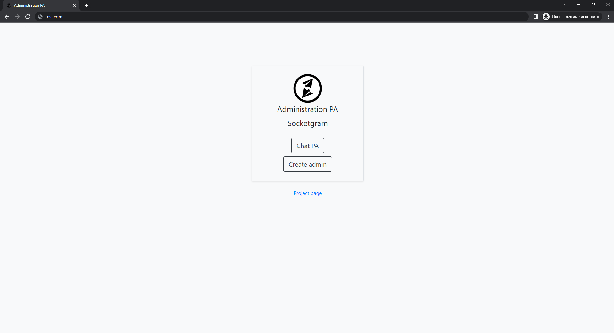
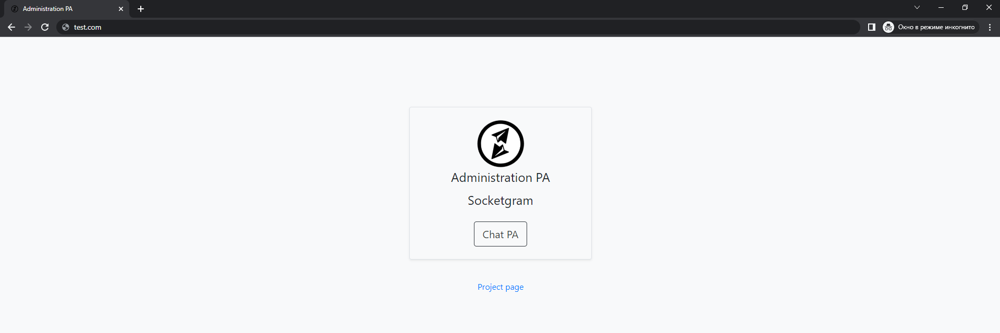
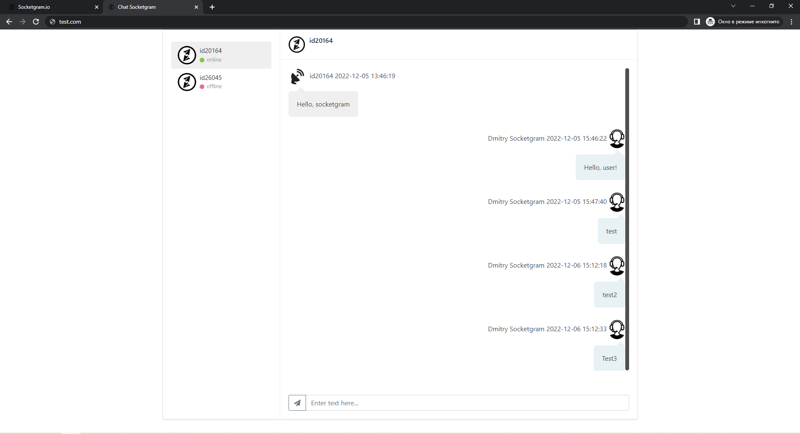

## <a name="adminphp"></a> Административная панель на PHP

* [Начальная настройка](#startadminclient)
* [События административной панели](#eventadmin)
* [Вход в инструмент](#loginadmin)

### <a name="startadminclient"> Начальная настройка
Для старта работы требуется заполнить конфигурационные файлы `config/const.js` и `config/const.php`:
#### `config/const.js`
```js
//URL папки с административной панелью
const DOMEN = 'http://test.com/';

//Название логотипа компании
const LOGO_COMPANY = 'socketgram.io.min.png';

//URL сервера чата
const DOMEN_SERVER = 'https://your.domen.com/';

//Имя(пароль) и ключ для входа админа (определение сокета админа)
const SERVER_KEY = 'admin';
const SERVER_PSWD = 'adminpass';

//Название компании
const COMPANY = 'Socketgram';
```

#### `config/const.php`
```php
/*************************Дефолтные параметры**********************************/
define("SUPER_USER", 'VDS13');                                       //Логин суперюзера/администатора
define("SECRET_KEY", 'key');                                         //Секретный ключ
define("COMPANY", 'Socketgram');                                     //Название компании
define("LOGO_COMPANY", 'socketgram.io.min.png');                     //Логотип компании(PNG)
define("LOGO_COMPANY_SVG", 'socketgram.io.svg');                     //Логотип компании(SVG)
define("HASHTYPE", 'md5');                                           //Тип хэширования комнат
define("DOMEN", 'http://test.com/');                                 //URL папки с административной панелью
define("SOCKETIO", 'https://your.domen.com/socket.io/socket.io.js'); //URL библиотеки socket.io на сервере чата

/*************************Аутентификация**********************************/
/*
На выбор имеется два типа аутентификации: LDAP и MySQL
Для запуска определенного типа требуется раскомментировать нужный 'LOG_IN' и ввести значения констант
*/
//////////////////////////LDAP Аутентификация////////////////////////////////
define("LOG_IN",'../../config/auth_type/ldap.php');
define("USER_LDAP", 'uid=reader,ou=people,dc=test');                 //Определитель reader-пользователя LDAP
define("PASSWORD_LDAP", 'superreader');                              //Пароль reader-пользователя LDAP
define("HOST_LDAP", '192.168.1.1');                                  //Хост LDAP сервера
define("PORT_LDAP", 389);                                            //Порт LDAP сервера
define("BASEDB_LDAP", 'dc=test');                                    //Base DN
define("GROUP_LDAP", 'cn=allow,ou=groups,o=socketgram,dc=test');     //Группа пользователь LDAP с доступом к чату

//////////////////////////MySQL Аутентификация///////////////////////////////
//define("LOG_IN",'../../config/auth_type/mysql.php');
define('HOST_ADMIN', '192.168.2.6');                                 //IP базы данных
define('DB_ADMIN', 'admin');                                         //Имя базы данных
define('USER_ADMIN', 'admin');                                       //Пользователь БД
define('PSWD_ADMIN', 'qwerty');                                      //Пароль пользователя БД
define("HASHTYPE_ADMIN", 'md5');                                     //Тип хэширования пароля администратора
define(
	"MYSQL_QUERY_ADMIN",
	'SELECT COUNT(*) AS col FROM admin WHERE login = ? AND LOWER(password) = ?'
);                                                                   //Запрос на проверку наличия администратора в базе

/*************************Сервер чата**********************************/
/*
На данный момент сервер чата работает только на MySQL
*/
//////////////////////////MySQL start config//////////////////////////////
define("START_PAGE", 'config/start_type/mysql.php');
define('HOST_CHAT', '192.168.3.3');                                  //IP сервера чата
define('DB_CHAT', 'chat');                                           //Название БД
define('USER_CHAT', 'qqqqqqqq');                                     //Пользователя БД чата
define('PSWD_CHAT', 'ppppppppp');                                    //Пароль пользователя БД чата
```

### <a name="eventadmin"> События административной панели

Административной панели обрабатывает следующие события:
```js
socket.on('new message', (
    {
        username: username,         //Идентификатор пользователя (К примеру: 123)
        message: message,           //Сообщение
        label: label,               //Идентификатор сообщения
        date: date,                 //Время и дата отправки
        adm: login_admin            //Имя администратора(если сообщение написано клиентом, параметр равен 0)
    }) => {});                      //Сообщение от админа/пользователя
```
```js
socket.on('online', (
    {
        cid: cid                    //Идентификатор пользователя (К примеру: 123)
    }) => {});                      //Вход пользователя
```
```js
socket.on('offline', (
    {
        cid: cid                    //Идентификатор пользователя (К примеру: 123)
    }) => {});                      //Выход пользователя
```

### <a name="loginadmin"> Вход в инструмент

При открытии страницы инструмента, сначала пользователя перебрасывает на страницу аутентификации:

После успешной аутентификации, проходит авторизация и открывается меню администратора.

Права и имена администраторов устанавливаются в инструменте `/createadmin` и заносятся в таблицу `adm_account`, имеющую следующие столбцы:
```
aid - идентификатор(логин) администратора
name - имя администратора
lid - код прав доступа
```
На данный момент имеются следующие коды прав доступа:
```
-1 - Права суперюзера(установленные в конфигурационном файле), если в таблице `adm_account` суперюзер не внесен - доступен только `createadmin`
0 - Администратор с таким логином не создан в базе данных чата
1 - Администратору доступны все инструменты
2 - Администратору доступен только чат
```
Скрины по типов меню в зависимости от прав предоставлены ниже:
#### `-1`


#### `0`


#### `1`


#### `2`


Нажав `Chat PA`, открывается чат `/chat`:


В боковом меню имеется выбор клиента, в центральном поле-сам чат.
При отсутствии сообщений от клиентов за последний месяц, администатору, при нажатии `Chat PA`, открывается следующая страница:


Все сообщения хранятся в таблице `messages`, имеющей следующие столбцы:
```
id - идентификатор сообщения
cid - идентификатор(id) клиента
aid - идентификатор(логин) администратора(если сообщение от клиента, aid = 0)
direction - направление сообщения(1-от клиента, 2-от администратора)
date - время и дата отправки сообщения
message - текст сообщения
check_msg и check_msg_admin на данный момент не используются
```