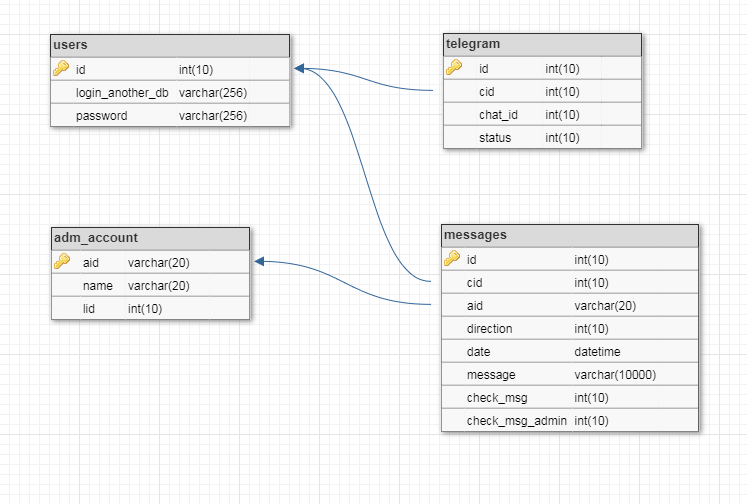
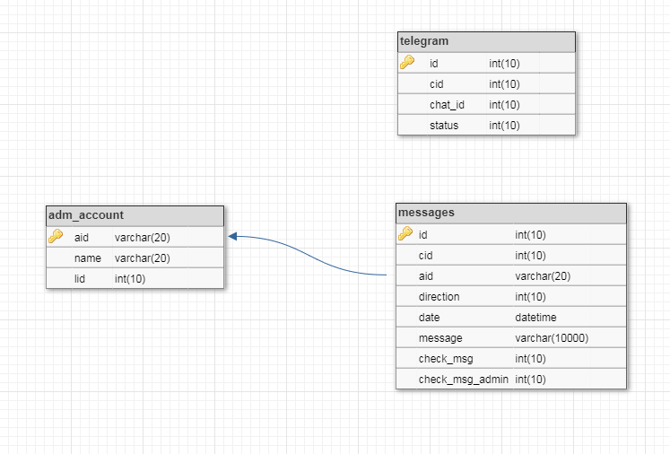

## <a name="server"></a> Chat server

* [Structure](#struct)
* [Installation](#install)
* [Configuration file](#conf)
* [Server events](#event)

### <a name="struct"> Structure
```
- config - directory for storing configuration files
  - db - directory for storing files to create databases
  - language - directory for storing configuration files for message and menu languages
  conf.js - configuration file
- src
  - db
    - mysql.js - MySQL database class
  - server.js - server class
- index.js - server main file
- package.json
```

### <a name="install"> Install
Copy the contents of the folder (or the folder itself) `server` to `/var/www/html`, navigate to the folder, then in the console type:
```sh
npm install
```
The next step is to install the database. Currently only MySQL is supported.
To install the database, install MySQL-server, then, being in the folder with the contents of the `server` project folder, enter in the console:
```sh
npm run createmysqldb
```
Next, enter the `root` password of the MySQL user.

There are two variations of the database:
#### Database with imported user data


The `users` table contains user credentials. If an ID is used to identify users, the `login_another_db` field is left blank.
The `adm_account` table stores a list of administrators (login, signature and rights level)
The `telegram` table stores the `chat_id` associated with user accounts.
The `messages` table stores all messages.

To install this structure, enter in the console
```sh
npm run mysqltables
```
Next, enter the `root` password of the MySQL user.

#### Database without importing user data


The structure is the same, the only difference is that there is no `users` table.

To install this structure, enter in the console
```sh
npm run mysqltables_anotherdb
```
Next, enter the `root` password of the MySQL user.
Next, you need to fill in the configuration file and enter in the console:
```sh
npm run start
```

### <a name="conf"> Configuration file
The configuration file `config/conf.js` has the following settings:
#### General settings
```js
/**
 * Company name
 * @param {String} company 
*/
const company = 'Socketgram';

/**
 * Company contacts (HTML format)
 * @param {String} techcontacts
*/
const techcontacts = '<b>Technical support(round-the-clock):</b>\nPhone numbers:\n+1(234)567-89-12';
```
#### Server settings
```js
/**
 * Internet protocol
 * @param {String} protocol - http/https
*/
const protocol = 'https';
/**
 * Domen
 * @param {String} hostname
*/
const hostname = "your.domen.com";
/**
 * If https is selected, fill in the block below (paths to the certificate and private key)
*/
const key = '/etc/ssl/privkey.pem';
const cert = '/etc/ssl/cert.pem';
const sslconf = protocol === 'https' ?
    {
        hostname: hostname,    // Domen server
        key: fs.readFileSync(key),    // Path to file with PEM private key
        cert: fs.readFileSync(cert)   // Path to file with PEM certificate
    } : undefined;
/**
 * TCP/IP Port
 * @param {String|Number} port
*/
const port = 443;

/**
 * Message and bot menu language
 * @param {String} lang - ru/en
*/
const lang = 'ru';

/**
 * GMT timezone
 * @param {String|Number} time
*/
const time = 3;

/**
 * Secret key (used to form rooms)
 * @param {String} secretkey
*/
const secretkey = 'qwerty';

/**
 * Hash type for forming rooms
 * @param {String} hashtype
*/
const hashtype = 'md5';

/**
 * Password hash type
 * If hashing is not used, set the value to ''
 * @param {String} hashpswd
*/
const hashpswd = 'md5';

/**
 * Admin login name and key (admin socket definition)
 * @param {String} adminkey
 * @param {String} adminname
*/
const adminkey = 'admin';
const adminname = 'adminpass';

/**
 * Database type (currently MySQL only)
 * @param {String} dbtype - mysql/postgres/mongo
*/
const dbtype = 'mysql';

/**
 * Data to connect to the chat database
 * @param {Object} db
*/
const db = {
	host: "localhost",
	user: "server_chat",
	database: "chat",
	password: "yourpass"
};

/**
 * Data for connecting to the customer database (which stores user credentials)
 * If a schema with data import is used, this object is not used
 * @param {Object} dbadmin
*/
const dbadmin = {
	host: "192.168.1.1",
	user: "admin",
	database: "users",
	password: "yourpass"
};
/**
 * Request for user authentication in a third-party database (For example: 
 *     SELECT count(*) AS col, id FROM ur WHERE concat("id",id) = ? AND pswd = ?'
 * )
 * If a schema with data import is used, this variable is not populated
 * @param {String} auth
*/
const auth = '';
```
#### Телеграм
```js
/**
 * Telegram token
 * @param {String} token
*/
const token = '0101010101:AAAAAAAAAAAAAAAAMQwQQwQQwQQwQQwQQwQ';

/**
 * Telegram bot operation method (false - WebHook, true - polling)
 * Note: Webhook only works on https protocol
 * @param {Object} tlgrm_option
*/

const tlgrm_option = {
	polling: false
};

/**
 * force reply option (default value)
 * @param {Object} optforce
*/
const optforce = {
    reply_markup:
        {
            force_reply: true
        },
        parse_mode : "HTML"
}
```

### <a name="event"> Server events

The server handles two types of events: Socket.io и Telegram Bot.

Socket.io events include:
```js
socket.on('subscribe:servadm', (
    {
        room: room,                 //Room
        adm: login_admin            //Admin login
    }) => {});                      //Admin entry to a specific room
```
```js
socket.on('subscribe', (
    {
        room: room,                 //Room
        username: username          //User ID (For example: 123)
    }) => {});                      //User entry into the room
```
```js
socket.on('new message:servadm', (
    {
        username: username,         //Client ID (For example: 123)
        message: message,           //Message
        room: room,                 //Room
        adm: login_admin            //Admin login
    }) => {});                      //Sending a message from the administrator to a specific client
```
```js
socket.on('new message', (
    {
        username: username,         //Client ID (For example: 123)
        message: message,           //Message
        room: room                  //Room
    }) => {});                      //Sending a message from client to administrator
```
```js
socket.on('take history', (
    {
        username: username,         //Client ID (For example: 123)
        room: room,                 //Room
        mid: messageId              //ID of the last message in the chat
    }) => {});                      //Uploading 10 messages from the history to the user
```
```js
socket.on('disconnect', () => {});  //Exit chat
```

Telegram Bot events include `message`, `callback_query`(Contacts) и `/start`.