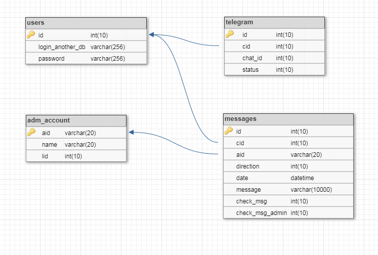

## <a name="server"></a> Сервер чата

* [Структура](#struct)
* [Установка](#install)
* [Конфигурационный файл](#conf)
* [События сервера](#event)

### <a name="struct"> Структура
```
- config - директория для хранения конфигурационных файлов
  - db - хранит файлы для создания баз данных
  - language - хранит конфигурационные файлы для языков сообщений и меню
  conf.js - конфигурационный файл
- src
  - db
    - mysql.js - класс для работы с базой MySQL
  - server.js - класс для работы сервера
- index.js - основной файл сервера
- package.json
```

### <a name="install"> Установка
Скопируйте содержимое папки(или саму папку) `server` в `/var/www/html`, перейдите в папку, далее в консоли введите:
```sh
npm install
```
Далее требуется установить базу данных. На данный момент поддерживается только MySQL.
Для установки БД, установите MySQL-server, далее, находясь в папке с содержимым папки проекта `server`, введите в консоли:
```sh
npm run createmysqldb
```
Далее введите пароль `root` пользователя MySQL.

Есть две вариации базы данных:
#### База данных с импортированными данными о пользователях


В таблице `users` находятся учетные данные пользователей. Если для идентификации пользователей используется ID, поле `login_another_db` не заполняется.
В таблице `adm_account` хранится список администраторов(логин, подпись и уровень прав)
В таблице `telegram` хранятся привязанные `chat_id` к учётным записям пользователей.
В таблице `messages` хранятся все сообщения.

Для установки данной структуры введите в консоли
```sh
npm run mysqltables
```
Далее введите пароль `root` пользователя MySQL.

#### База данных без импортирования данных пользователей


Структура та же, отличие лишь в отсутствии таблицы `users`.

Для установки данной структуры введите в консоли
```sh
npm run mysqltables_anotherdb
```
Далее введите пароль `root` пользователя MySQL.
Далее требуется заполнить конфигурационный файл и ввести в консоли:
```sh
npm run start
```

### <a name="conf"> Конфигурационный файл
Конфигурационный файл `config/conf.js` имеет следующие настройки:
#### Общие настройки
```js
/**
 * Название компании
 * @param {String} company 
*/
const company = 'Socketgram';

/**
 * Контакты компании (в формате HTML)
 * @param {String} techcontacts
*/
const techcontacts = '<b>Technical support(round-the-clock):</b>\nPhone numbers:\n+1(234)567-89-12';
```
#### Настройки сервера
```js
/**
 * Интернет-протокол
 * @param {String} protocol - http/https
*/
const protocol = 'https';
/**
 * Домен
 * @param {String} hostname
*/
const hostname = "your.domen.com";
/**
 * Если выбран https, заполните блок ниже(пути к сертификату и приватному ключу)
*/
const key = '/etc/ssl/privkey.pem';
const cert = '/etc/ssl/cert.pem';
const sslconf = protocol === 'https' ?
    {
        hostname: hostname,    // Domen server
        key: fs.readFileSync(key),    // Path to file with PEM private key
        cert: fs.readFileSync(cert)   // Path to file with PEM certificate
    } : undefined;
/**
 * TCP/IP Порт
 * @param {String|Number} port
*/
const port = 443;

/**
 * Язык сообщений и меню бота
 * @param {String} lang - ru/en
*/
const lang = 'ru';

/**
 * Часовой пояс GMT
 * @param {String|Number} time
*/
const time = 3;

/**
 * Секретный ключ (используется для формирования комнат)
 * @param {String} secretkey
*/
const secretkey = 'qwerty';

/**
 * Тип хэширования для формирования комнат
 * @param {String} hashtype
*/
const hashtype = 'md5';

/**
 * Тип хэширования паролей
 * Если хэширование не используется, значение установите ''
 * @param {String} hashpswd
*/
const hashpswd = 'md5';

/**
 * Имя и ключ для входа админа (определение сокета админа)
 * @param {String} adminkey
 * @param {String} adminname
*/
const adminkey = 'admin';
const adminname = 'adminpass';

/**
 * Тип базы данных (на данный момент только MySQL)
 * @param {String} dbtype - mysql/postgres/mongo
*/
const dbtype = 'mysql';

/**
 * Данные для подключения к базе данных чата
 * @param {Object} db
*/
const db = {
	host: "localhost",
	user: "server_chat",
	database: "chat",
	password: "yourpass"
};

/**
 * Данные для подключения к базе данных клиентов (в которой хранятся учётные данных пользователей)
 * Если используется схема с импортированием данных, данный объект не используется
 * @param {Object} dbadmin
*/
const dbadmin = {
	host: "192.168.1.1",
	user: "admin",
	database: "users",
	password: "yourpass"
};
/**
 * Запрос для аутентификации пользователя в сторонней базе (К примеру: 
 *     SELECT count(*) AS col, id FROM ur WHERE concat("id",id) = ? AND pswd = ?'
 * )
 * Если используется схема с импортированием данных, данная переменная не заполняется
 * @param {String} auth
*/
const auth = '';
```
#### Телеграм
```js
/**
 * Телеграм токен
 * @param {String} token
*/
const token = '0101010101:AAAAAAAAAAAAAAAAMQwQQwQQwQQwQQwQQwQ';

/**
 * Метод работы Телеграм-бота (false - WebHook, true - polling)
 * Примечание: Webhook работает только на https-протоколе
 * @param {Object} tlgrm_option
*/

const tlgrm_option = {
	polling: false
};

/**
 * force reply option (дефолтное значение)
 * @param {Object} optforce
*/
const optforce = {
    reply_markup:
        {
            force_reply: true
        },
        parse_mode : "HTML"
}
```

### <a name="event"> События сервера

Сервер обрабатывает два типа событий: Socket.io и Telegram Bot.

К событиям Socket.io относятся:
```js
socket.on('subscribe:servadm', (
    {
        room: room,                 //Комната
        adm: login_admin            //Логин админа
    }) => {});                      //Вход администратора в определённую комнату
```
```js
socket.on('subscribe', (
    {
        room: room,                 //Комната
        username: username          //Идентификатор пользователя (К примеру: 123)
    }) => {});                      //Вход пользователя в комнату
```
```js
socket.on('new message:servadm', (
    {
        username: username,         //Идентификатор пользователя (К примеру: 123)
        message: message,           //Сообщение
        room: room,                 //Комната
        adm: login_admin            //Логин админа
    }) => {});                      //Отправка сообщения от администратора определённому пользователю
```
```js
socket.on('new message', (
    {
        username: username,         //Идентификатор пользователя (К примеру: 123)
        message: message,           //Сообщение
        room: room                  //Комната
    }) => {});                      //Отправка сообщения от пользователя администратору
```
```js
socket.on('take history', (
    {
        username: username,         //Идентификатор пользователя (К примеру: 123)
        room: room,                 //Комната
        mid: messageId              //ID последнего сообщения в чате
    }) => {});                      //Выгрузка из истории 10 сообщений пользователю
```
```js
socket.on('disconnect', () => {});  //Выход из чата
```

К событиям Telegram Bot относятся `message`, `callback_query`(Контакты) и `/start`.