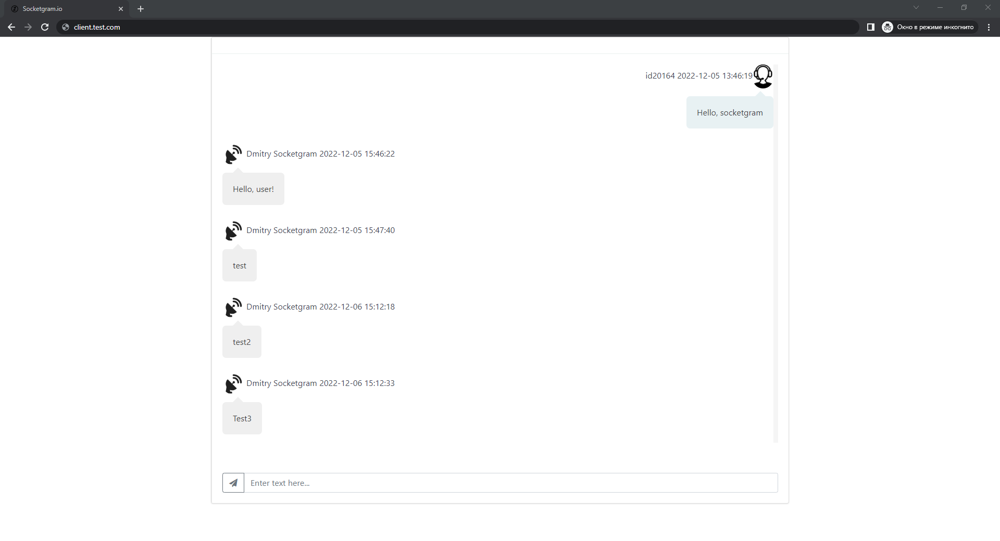
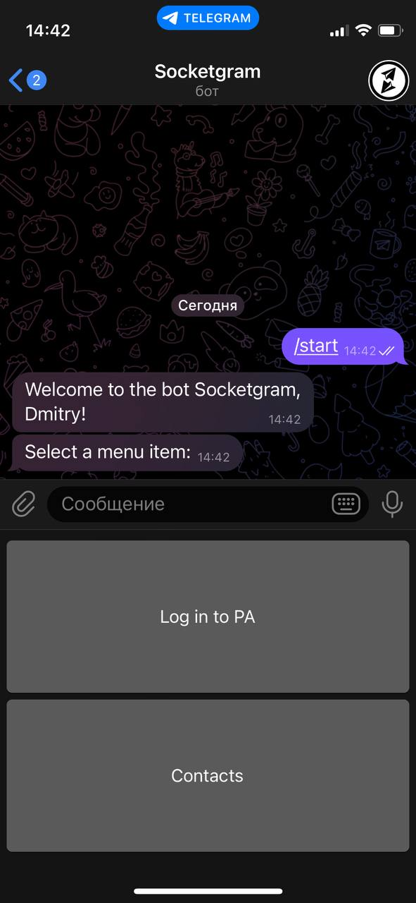
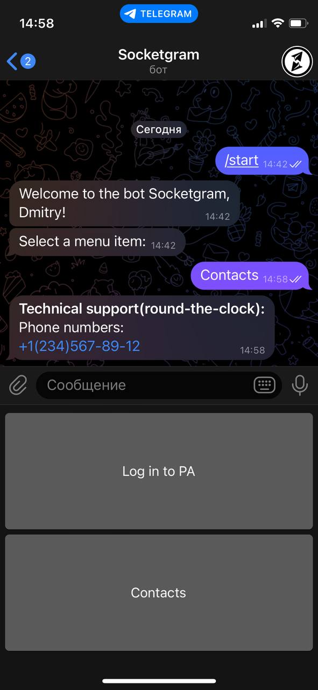
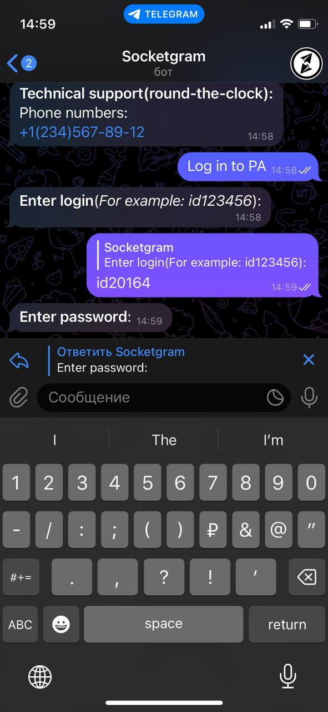
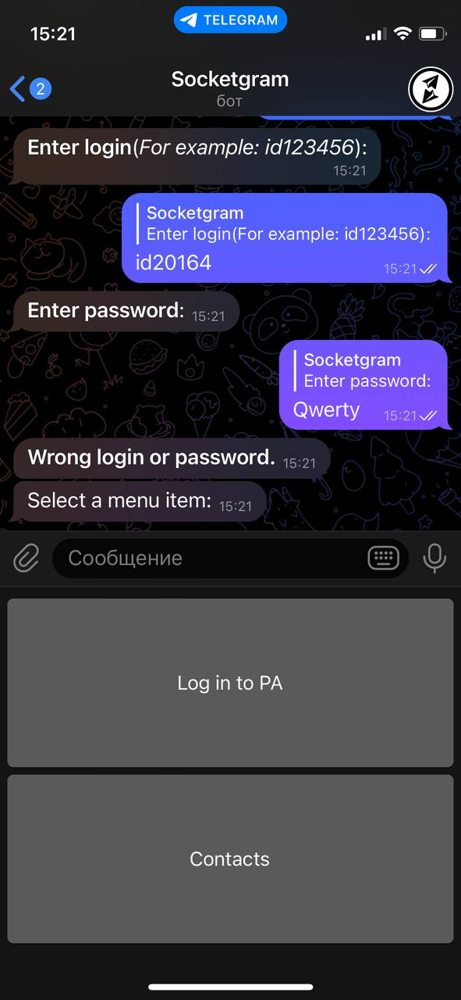
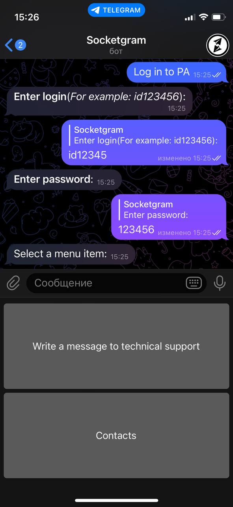
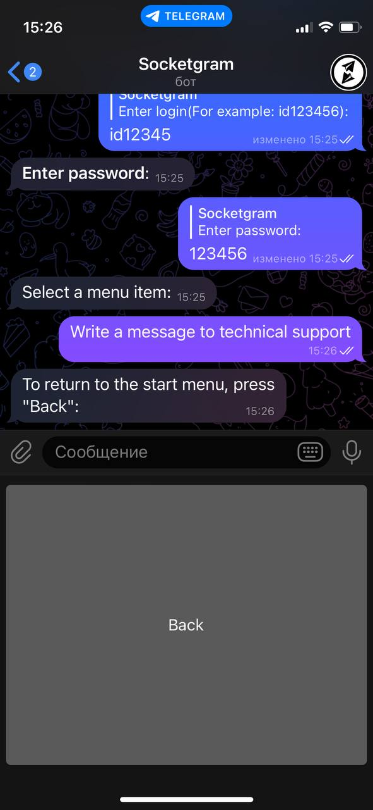
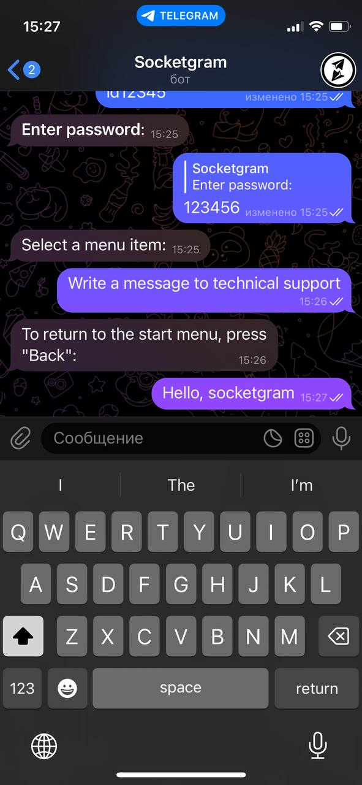
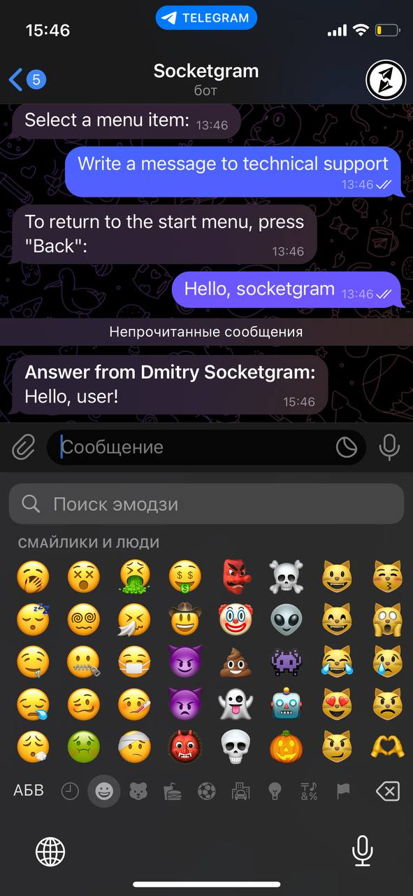

## <a name="clientphp"></a> Client block

* [Initial setup](#startuserclient)
* [Client block events](#eventuser)
* [Telegram-bot](#usertlgrm)

### <a name="startuserclient"> Initial setup
To start work, you need to fill in the configuration file `js/const.js`:
#### `js/const.js`
```js
//URL of the admin panel folder
const DOMEN = 'http://test.com/';

//Company logo
const LOGO_COMPANY = 'socketgram.io.min.png';

//Chat Server URL
const DOMEN_SERVER = 'https://your.domen.com/';
```
You also need to set the `sessionStorage` values ​​(you can use an Ajax request):
```js
sessionStorage.setItem("id", "Client ID (for example: 123)");
sessionStorage.setItem("room", "Room hash");
```
The page looks like this:


### <a name="eventuser"> Client block events

The client panel handles the following events:
```js
socket.on('new message', (
    {
        username: username,         //Client ID (for example: 123)
        message: message,           //Message
        label: label,               //Message ID
        date: date,                 //Date and time
        adm: login_admin            //Administrator name (if the message was written by the client, the parameter is 0)
    }) => {});                      //Message from admin/user
```
```js
socket.on('new message history', (
    {
        username: username,         //Client ID (for example: 123)
        message: message,           //Message
        label: label,               //Message ID
        date: date,                 //Date and time
        adm: login_admin            //Administrator name (if the message was written by the client, the parameter is 0)
    }) => {});                      //Uploading message history
```
```js
socket.on('drop history button',() => {}); //Removing the download history button
```
```js
socket.on('add history button',() => {}); //Adding a button to load the message history
```

### <a name="usertlgrm"> Telegram-bot

Calling `/start` starts the telegram bot:
<br>


By pressing `Contacts`, the contacts of the company are displayed:
<br>


By clicking `Log in to PA`, the authorization process begins:
<br>


If the username/password is incorrect, the following message appears:
<br>


With correct authorization, the menu changes:
<br>


To write to technical support, you need to click the `Write a message to technical support` button:
<br>



The response from the administrator looks like this:
<br>
