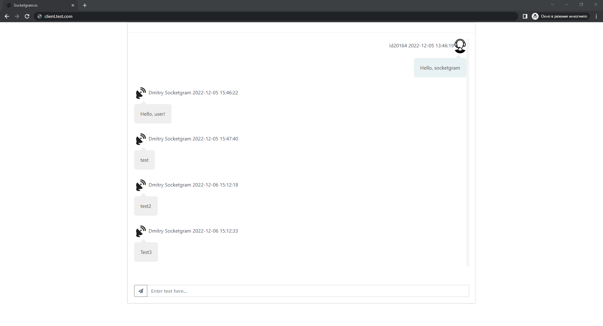
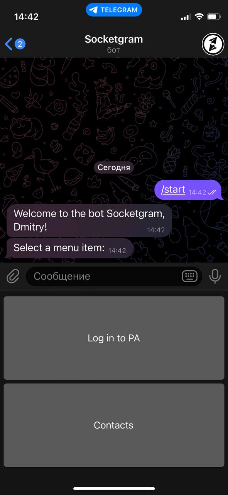
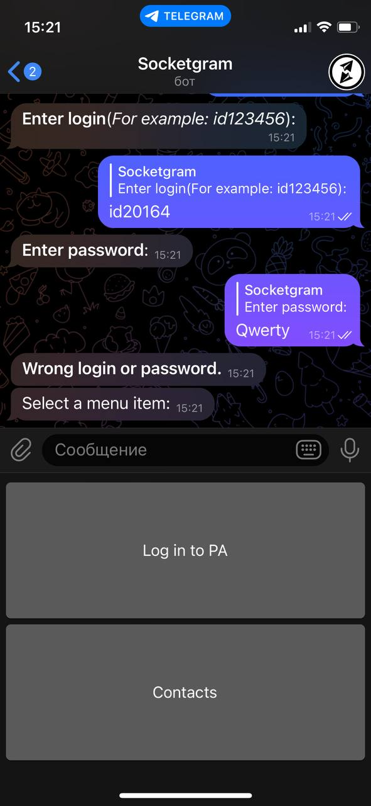
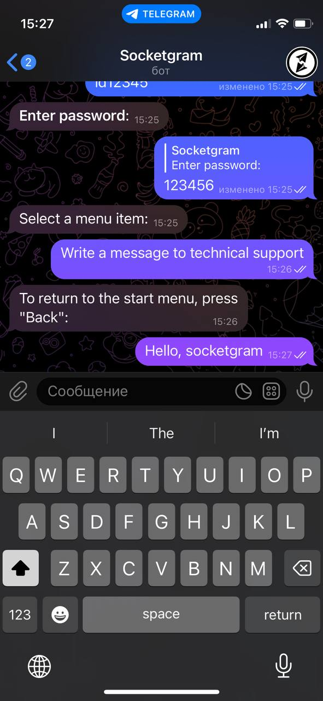
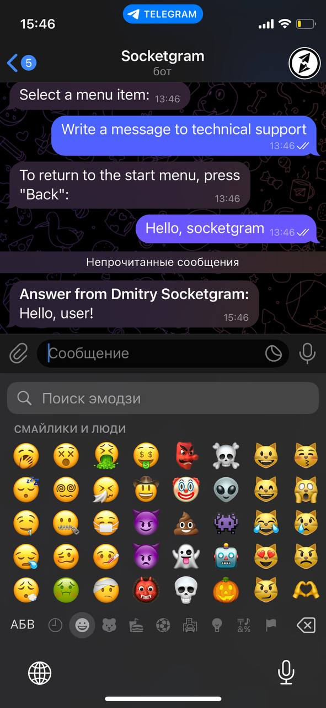

## <a name="clientphp"></a> Клиентский блок

* [Начальная настройка](#startuserclient)
* [События клиентского блока](#eventuser)
* [Телеграм-бот](#usertlgrm)

### <a name="startuserclient"> Начальная настройка
Для старта работы требуется заполнить конфигурационные файлы `js/const.js`:
#### `js/const.js`
```js
//URL папки с административной панелью
const DOMEN = 'http://test.com/';

//Название логотипа компании
const LOGO_COMPANY = 'socketgram.io.min.png';

//URL сервера чата
const DOMEN_SERVER = 'https://your.domen.com/';
```
Также требуется установить значения `sessionStorage`(можно путём Ajax-запроса):
```js
sessionStorage.setItem("id", "Идентификатор клиента (к примеру: 123)");
sessionStorage.setItem("room", "Хэш комнаты");
```
Страница выглядит следующем образом:


### <a name="eventuser"> События клиентского блока

Клиентская панель обрабатывает следующие события:
```js
socket.on('new message', (
    {
        username: username,         //Идентификатор пользователя (К примеру: 123)
        message: message,           //Сообщение
        label: label,               //Идентификатор сообщения
        date: date,                 //Время и дата отправки
        adm: login_admin            //Имя администратора(если сообщение написано клиентом, параметр равен 0)
    }) => {});                      //Сообщение от админа/пользователя
```
```js
socket.on('new message history', (
    {
        username: username,         //Идентификатор пользователя (К примеру: 123)
        message: message,           //Сообщение
        label: label,               //Идентификатор сообщения
        date: date,                 //Время и дата отправки
        adm: login_admin            //Имя администратора(если сообщение написано клиентом, параметр равен 0)
    }) => {});                      //Подгрузка истории сообщений
```
```js
socket.on('drop history button',() => {}); //Удаление кнопки подгрузки истории сообщений
```
```js
socket.on('add history button',() => {}); //Добавление кнопки подгрузки истории сообщений
```

### <a name="usertlgrm"> Телеграм-бот

Вызов `/start` запускает телеграм-бота:
<br>


Нажав `Contacts`, выводятся контакты компании:
<br>


Нажав `Log in to PA`, начинается процесс авторизации:
<br>


При неверном логине/пароле приходит следующее сообщение:
<br>


При корректной авторизации изменяется меню:
<br>


Чтобы написать в техподдержку, нужно нажать кнопку `Write a message to technical support`:
<br>



Ответ от админиистратора выглядит следующим образом:
<br>
